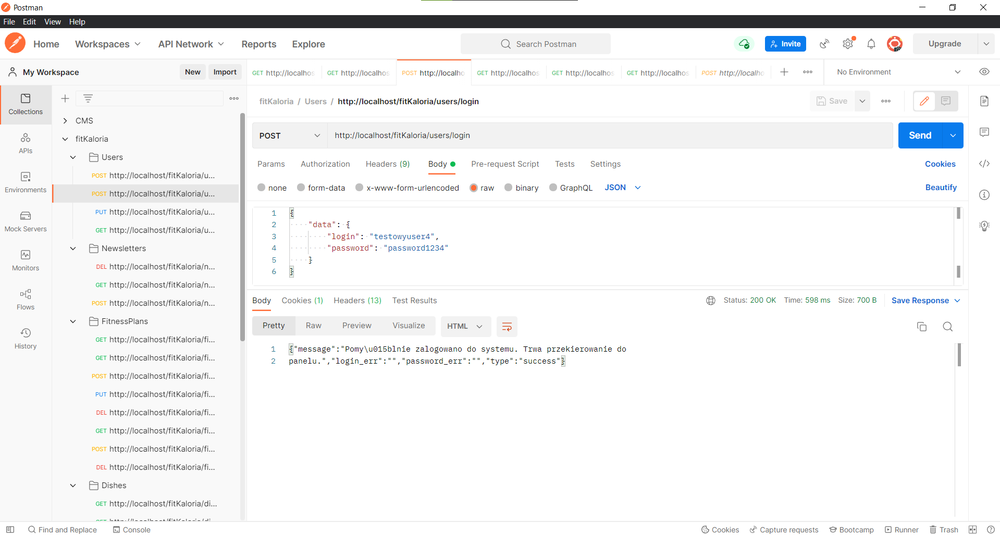
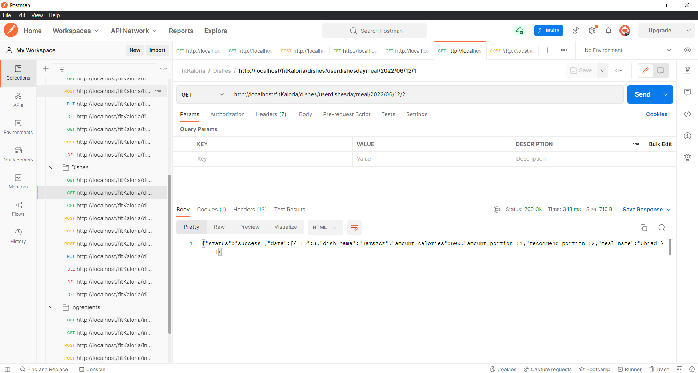
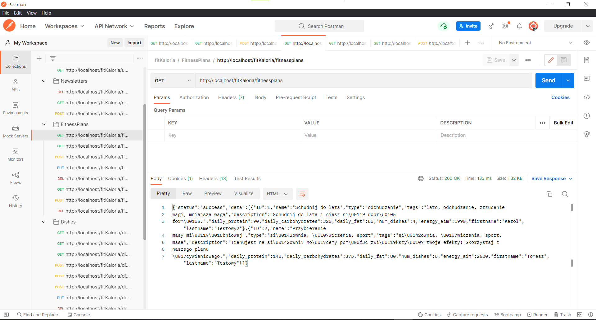
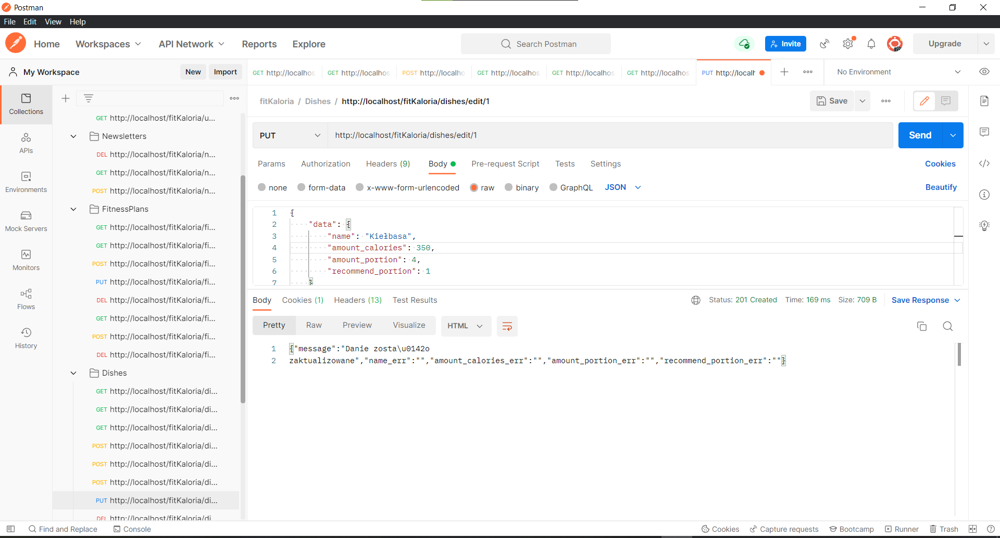
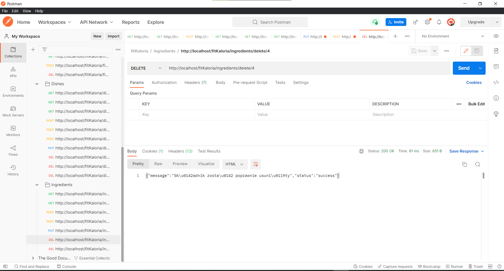
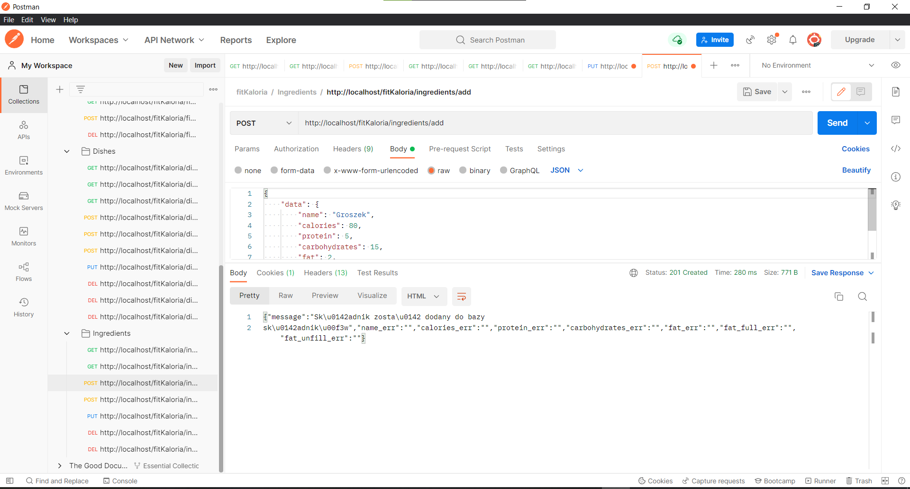

# fitKaloria - REST API project
Study project to manage diethetic app. 
App allows on choose diethetics plan, adding diethethic plan, removing diethetic plan, edit diethethic plan. It is possible for dishes and ingredients too. Diethethic plan consist of dishes. Each user is able to track his dishses on day by adding his meal in day. Each dishes consist of ingredients. Ingredient has nutritient. Due to organise data in that way is possible to count calorics from each meal. App allow to be both author diethethic plan and common user who use diethethic plan. 

App is based on MVC architecture and managment by URL address. Due to REST API each answer is return in JSON. It is convenient to handle in JavaScript.

## Technologies
- PHP
- MariaDB

App handles connection with database by PDO extension in PHP. Each request is executed by set in address suitable controller and his method. Also it need to be suitable protocol of request. In project is set a file for Postman with available requests.

## Example of requests and answers

### Login

### Get user's meals from direct date

### Get available diethethic plans

### Editing dishes

### Deleting ingredient

### Adding ingredient

